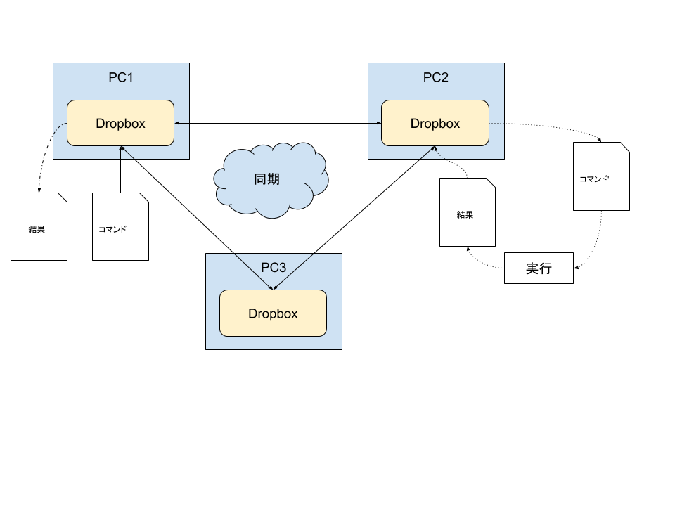

# goropbox

Dropboxのファイル同期機能を利用してリモートPCでコマンドを実行します。

リクエストをファイルとしてDropbox上のディレクトリに配置すると、リモートPCに同期されるとgoropboxによりコマンドが実行され実行結果がファイルとして作成されます。



## 使い方

リモートPCでgoropboxを実行する
```
$ go run goropbox.go -dir 監視ディレクトリ -interval 監視する間隔 -count 監視する回数
```

ローカルPCのDropbox上の監視ディレクトリにリクエストファイルを配置する

vi 監視するディレクトリ/request1.req
```
マシン名
sh -c ls -l
```

DropboxでリモートPCにリクエストファイルが同期され、goropboxによりコマンドが実行され結果がファイルとして出力されます。

### 実行結果

cat 監視するディレクトリ/request1.req.res
```
マシン名
2019-06-18 19:40:33.3194002 +0900 DST m=+0.002673801
2019-06-18 19:40:33.3341825 +0900 DST m=+0.017456101
0
```

### 標準出力

cat 監視するディレクトリ/request1.req.out
```
README.md
executor
goropbox.go
monitor
```

### ヘルプ
```
$ go run goropbox.go --help
```

## テキストファイル仕様

リクエストファイル(*.req)
```
マシン名
コマンド [引数]
```

結果ファイル(*.res)
```
マシン名
実行開始日時
実行完了日時
戻り値
```

